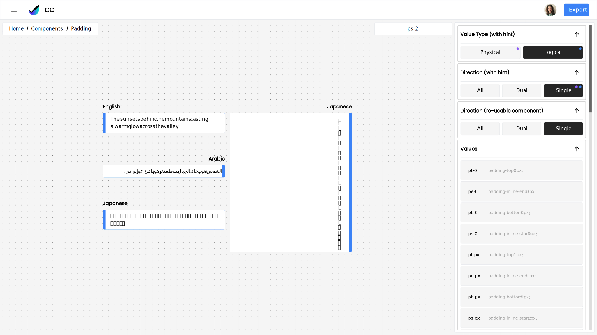

# TCC Concept

[Live Demo on Vercel](https://tvhq-tcc-concept.vercel.app/)

&nbsp;

&nbsp;

This project was generated with [Analog](https://analogjs.org), the fullstack meta-framework for Angular.

## Setup

Run `npm install` to install the application dependencies.

## Development

Run `npm start` for a dev server. Navigate to `http://localhost:5173/`. The application automatically reloads if you change any of the source files.

## Build

Run `npm run build` to build the client/server project. The client build artifacts are located in the `dist/analog/public` directory. The server for the API build artifacts are located in the `dist/analog/server` directory.
